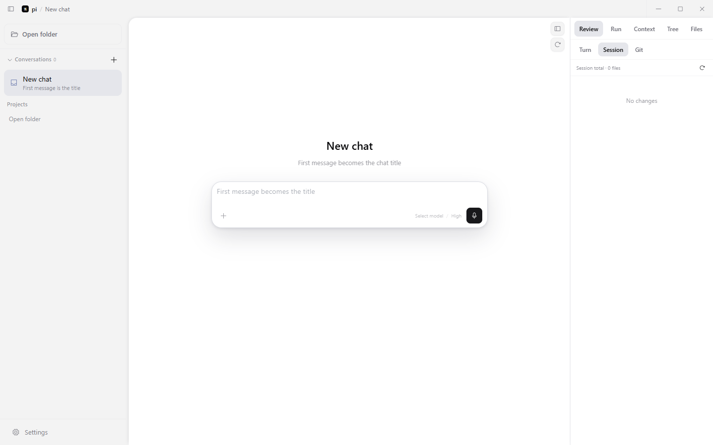

<div align="center">


# pi Desktop

[pi](https://github.com/jvm/pi-mono) 编码助手的桌面应用 — 终端里跑的那个 Agent，现在有了时间线、侧栏和一个正经窗口。

[](https://github.com/kahme247/PI/releases/tag/v0.0.1)
[](https://github.com/kahme247/PI/releases/latest)
[](https://github.com/kahme247/PI/actions)
[](https://github.com/kahme247/PI/actions)
[](LICENSE)
[](CHANGELOG.md)

[English](./README.md) · [操作指南](./doc/guide/getting-started.zh-CN.md) · [适配器列表](./doc/guide/adapters.zh-CN.md) · [更新日志](./CHANGELOG.md) · [发版说明](./doc/RELEASE.md)

</div>

> [!NOTE]
> pi Desktop **不是**另一个 AI — 它是你已经在用的 pi SDK 的桌面外壳。对话、模型登录和扩展设置都在同一个 `~/.pi/agent` 目录里。打开项目，接着终端里的对话继续聊。



*主界面 — v0.0.1，默认英文，流式时间线 + 会话树 + 文件预览（1440×900，2026-08-30 截取）*

## 为什么需要

在终端用 pi 时，你大概也想过：要是有个真正的 diff 视图，而不是翻原始输出就好了；能在 Agent 还在跑的时候排队发下一条就好了；会话树能点着走，不用敲 `/tree` 就好了。pi Desktop 把这些都给你了，还给扩展弹窗配了原生窗口 — **不 fork pi，也不动你已装的扩展**。

## 功能

- **流式时间线** — Markdown、代码块、KaTeX 公式、可折叠工具步骤（读文件、改代码、执行命令），改动有行级 diff
- **会话树** — 像 `pi /tree` 一样分支与回退，但能点；有 git 时跳转可顺便恢复文件
- **输入区** — 内联文件附件、粘贴图片、模型与思考等级切换、斜杠命令菜单；右栏 **文件** 树可 **拖文件进输入区** 或右键附加
- **工作区文件预览** — 多标签（`Ctrl`/`⌘`+点击或右键新标签）、行号源码预览、一键 **展开到聊天区** 宽屏阅读
- **排队消息** — Agent 运行时继续输入，当前轮次结束自动跟进
- **完整 pi 包生态** — 你给终端 pi 装的每个扩展都能在桌面用：对话框、工具卡片、侧栏、`/命令` 由每个扩展的**适配器**翻译成原生 UI，**不改 npm 包**（见[扩展](#扩展)）
- **默认英文，双语可用** — 默认 English，**设置 → 通用** 随时切回中文
- **语音输入** — 可选，麦克风 → 本地转写，基于 [codex-asr](https://github.com/Wangnov/codex-asr)（内置二进制，ChatGPT/Codex token 认证）
- **全部共享** — 会话、认证、`settings.json`、扩展：都在 `~/.pi/agent`，与终端 pi 共用
- **跨平台安装包** — Windows（NSIS 安装包 + 便携版）、macOS（dmg + zip，x64 & arm64）、Linux（AppImage + deb），由 [`Release` 工作流](.github/workflows/release.yml) 自动构建，并附 SBOM、校验和与来源证明

## 下载

**Releases：** 到 [kahme247/PI Releases](https://github.com/kahme247/PI/releases/latest) 下载对应平台安装包（可同时下载 `SHA256SUMS.txt` 与 `sbom.cdx.json` 校验）。

> [!TIP]
> 本机先按你平时的方式配好 pi（模型登录等）。之后在 pi Desktop 里打开项目文件夹就能用。

**自己编译**（开发者）：

```bash
git clone https://github.com/kahme247/PI.git
cd PI
npm install
npm run dev
```

> 上游是 [justhil/pi-app](https://github.com/justhil/pi-app) — 本分支在 `kahme247/PI` 独立维护，版本号自 `v0.0.1` 起。

## 上手

1. **打开文件夹** — 你的仓库就是 Agent 的工作目录（或在「对话分区」里用沙箱随便试）。
2. **选会话** — 终端 pi 的历史会话会出现在这；或点 `+` 新开。
3. **发一条消息** — `Enter` 发送，`Shift+Enter` 换行。
4. **看右栏** — 审查、运行、上下文、会话树，或 **文件**（标签预览 + 目录树；可展开预览占满聊天列）。
5. **回跳** — 悬停消息点回退，或输入为空时连按两次 `Esc` 打开会话树。

## 快捷键

| 操作 | 按键 |
|------|------|
| 发送 | `Enter` |
| 换行 | `Shift+Enter` |
| 翻看发过的消息 | `↑` / `↓`（输入为空时） |
| 拉回排队消息 | `Alt+↑` |
| 停止生成 | `Esc` |
| 会话树 | `Esc` `Esc`（输入为空时） |
| 命令 | `/` |
| 添加文件 | 拖入、`+` 或 `Ctrl+V`；右栏 **文件** 树拖文件到输入区（仅文件） |
| 多标签预览 | 右栏 **文件** → `Ctrl`/`⌘`+点击文件，或右键「在新窗口打开」 |
| 宽屏预览 | 右栏 **文件** 顶栏 **展开预览**（占满聊天列，再点收起） |

## 扩展

pi 有不断壮大的 npm 包生态 — 子 Agent、生图、搜索、哈锡锚定编辑、MCP 服务器等等。pi Desktop 让这些扩展都能在桌面上工作，**不 fork pi，也不改包**。

### 原理

每个扩展都内置终端 TUI（选择、确认、问卷、工具卡片、`/命令`）。pi Desktop 提供**兼容层** + 每个扩展一份**适配器**（小段 JSON，把 TUI 映射到原生窗口、时间线卡片、设置表单）。安装和启用扩展与终端 pi 完全一样，pi Desktop 负责渲染。

### 安装与启用

1. 终端安装：`pi install npm:<包名>` 或 `pi install git:github.com/...`
2. 在 `~/.pi/agent/settings.json` → `packages` 里启用
3. 桌面 **设置 → 扩展** 看当前会话是否加载了对应工具
4. 没有的话，启用后 **新开或重开会话** 试一下

扩展弹窗（问卷、审图、确认框）显示为原生窗口。每个扩展的桌面配置在 **设置 → 桌面适配器**。高级用户可用 `~/.pi/desktop/adapters/` 里的 JSON 覆盖内置适配器。

内置 34 个适配器完整列表：[doc/guide/adapters.zh-CN.md](./doc/guide/adapters.zh-CN.md) · 编写自己的适配器：[doc/adapter-authoring-guide.md](./doc/adapter-authoring-guide.md)

## 语音输入

输入区麦克风录音后本地转写，基于 [codex-asr](https://github.com/Wangnov/codex-asr)。可选功能，不配也不影响打字。

### 配置

打开 **设置 → 语音输入**：

- **Provider** — 默认 **内置 `codex-asr serve` 二进制**（随应用打包在 `resources/codex-asr/`）；缺失时回退到系统 `PATH` 中的 `codex-asr`，或填外部 serve URL。
- **认证** — 粘贴 ChatGPT/Codex 的 `access_token`，或点 **从 `~/.codex/auth.json` 导入**（[Codex CLI](https://github.com/openai/codex) 或 ChatGPT 桌面端登录后生成）。token 是 JWT，会过期 — 重新登录即可刷新。
- **连通测试** — 一键检测 serve 进程是否启动、token 是否有效。

> [!TIP]
> 最简单：装 Codex CLI，跑 `codex login`，再在桌面里点 **从 auth.json 导入**，不用手动粘 token。

内置二进制来自 [codex-asr releases](https://github.com/Wangnov/codex-asr/releases)。缺失时回退到系统 `PATH` 中的 `codex-asr`。

## 更新日志与发版

- **更新日志：** [`CHANGELOG.md`](./CHANGELOG.md) — Keep a Changelog 格式，当前基线 `v0.0.1`。
- **发版指南：** [`doc/RELEASE.md`](./doc/RELEASE.md) — 如何发版（改 `CHANGELOG.md` + `package.json`，推标签 `v*`，CI 构建安装包并从 changelog 生成发布说明）。
- **CI：** [`Quality` 工作流](.github/workflows/quality.yml)（类型检查、lint、单元/E2E、构建矩阵）每次 push/PR 运行；[`Release` 工作流](.github/workflows/release.yml) 在打标签时构建 Windows/macOS/Linux 并发布 GitHub Release（附 SBOM + SHA256SUMS + 来源证明）。

## 常见问题

| 问题 | 试试 |
|------|------|
| 开发时白屏、界面不刷新 | 删 `node_modules/.vite`，再 `npm run dev` |
| 设置里有扩展，对话里没有工具 | 在 pi `packages` 里启用，再 **重启会话** |
| 换会话一开始有点慢 | 先显示最近一段，发消息或用树跳转后会补全 |
| 语音不可用 | 设置 → 语音输入；检查 token 或跑 `codex login` 刷新 — 不影响打字 |
| 误关了扩展弹窗 | 时间线点 **继续作答** |
| 截图过时 | 用 `npm run build` 后按 `doc/images/README.md` 重新截取 `doc/images/overview.png` |

## 赞助支持

如果 pi Desktop 对你有帮助，欢迎通过下方二维码支持项目的持续维护。


## 交流

讨论和反馈：**[LinuxDo](https://linux.do/)**

若 pi Desktop 让你少盯一会儿终端，欢迎 **[GitHub 点个 Star](https://github.com/kahme247/PI/stargazers)**，方便更多人看到。

---

<details>
<summary>开发者与扩展作者</summary>

- 用户文档：[`doc/`](./doc/README.zh-CN.md) — 操作指南、适配器列表、截图（`doc/images/overview.png`）
- 给 AI 写适配器：[doc/adapter-authoring-guide.md](./doc/adapter-authoring-guide.md)
- 技术：Electron 43 · React 18 · TypeScript 5.7 · Vite 8 · Tailwind · shadcn · Zustand · i18next · `@earendil-works/pi-coding-agent` 0.83
- 脚本：`npm run dev`（热更新）、`npm run build`（生产构建）、`npm run typecheck`、`npm run lint`、`npm run test:unit`、`npm run test:e2e`
- 发布：打标签 `v*` 触发 `.github/workflows/release.yml` → Windows、macOS、Linux 构建 + GitHub Release

</details>
